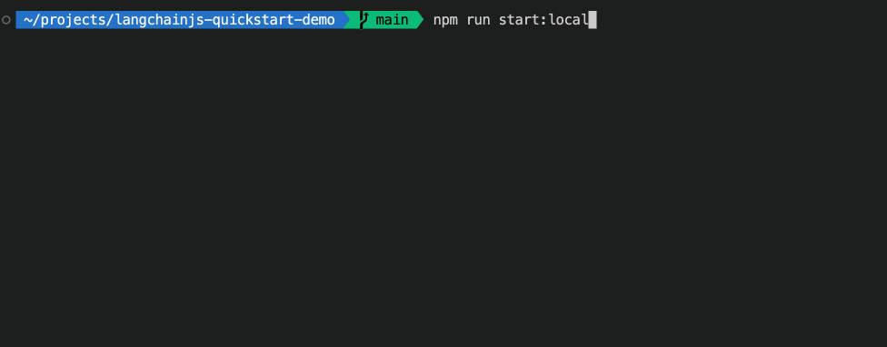
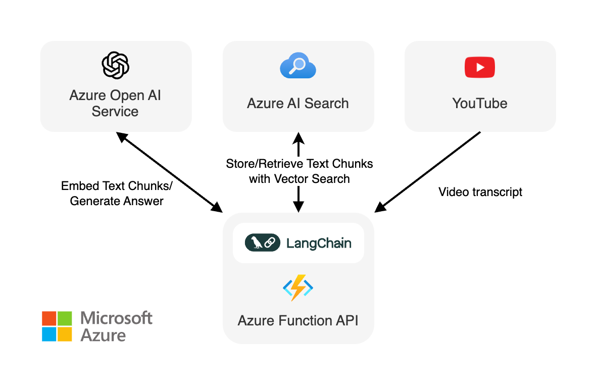

<div align="center">


# Ask YouTube: LangChain.js + Azure Quickstart

[](https://codespaces.new/Azure-Samples/langchainjs-quickstart-demo?hide_repo_select=true&ref=main)

[](LICENSE)

[](https://www.youtube.com/watch?v=nYXSKs8qMY8&list=PLI7iePan8aH7FRDmefj-NAnoxM9V0USZm&index=3)

⭐ If you like this sample, star it on GitHub — it helps a lot!

[Overview](#overview) • [Installation](#installation) • [Run the demo](#run-the-demo) • [Resources](#resources)



</div>

Discover the journey of building a generative AI application using LangChain.js and Azure.
This demo explores the development process from idea to production, using a RAG-based approach for a Q&A system based on YouTube video transcripts.

## Overview

This application allows to ask text-based questions about a YouTube video, and uses the transcript of the video to generate responses.

The code comes in two versions:
- [local prototype](src/local.js): uses FAISS and Ollama with LLaMa3 model for completion and all-minilm-l6-v2 for embeddings
- [Azure cloud version](src/azure.js): uses Azure AI Search and GPT-4 Turbo model for completion and text-embedding-3-large for embeddings

Either version can be run as an API using the [Azure Functions](https://azure.microsoft.com/services/functions) runtime.

> [!NOTE]
> This sample uses the new HTTP streaming support in Azure Functions that's currently in preview. You can find more information about this feature in the [blog post announcement](https://techcommunity.microsoft.com/t5/apps-on-azure-blog/azure-functions-support-for-http-streams-in-node-js-is-now-in/ba-p/4066575).

<div align="center">
  
</div>

## Installation

You need [Node.js](https://nodejs.org/en) and [Ollama](https://ollama.com/download) installed to run this demo.

After you complete the installation, the next step is to clone this repository on your machine:

1. [**Fork**](https://github.com/Azure-Samples/langchainjs-quickstart-demo/fork) the project to create your own copy of this repository.
2. On your forked repository, select the **Code** button, then the **Local** tab, and copy the URL of your forked repository.
    <div align="center">
      
    </div>
3. Open a terminal and run this command to clone the repo: `git clone <your-repo-url>`

Then open a terminal inside the project directory and run the following commands:

```bash
npm install
ollama pull llama3
ollama pull all-minilm:l6-v2
```

This will install the required dependencies and download the models needed for the demo.

## Run the demo

This demo comes in three versions: a local prototype, an Azure cloud version, and an API version using Azure Functions. The fastest way to get started is to run the local prototype.

### Local prototype

```bash
npm run start:local
```

### Azure version

To run the Azure version, you need to have an Azure account and a subscription enabled for Azure OpenAI usage. If you don't have an Azure account, you can create a [free account](https://azure.microsoft.com/free/) to get started.

For Azure OpenAI, you can [request access with this form](https://aka.ms/oaiapply).

#### Create the Azure resources

First you need to create an Azure OpenAI instance. You can deploy a version on Azure Portal following [this guide](https://learn.microsoft.com/azure/ai-services/openai/how-to/create-resource?pivots=web-portal).

In Azure AI Studio, you'll need to deploy these two models:
- `text-embedding-3-large` with a deployment name of `text-embedding-3-large`
- `gpt-4` version `0125-preview` (aka GPT-4 Turbo) with a deployment name of `gpt-4-turbo`

> [!IMPORTANT]
> GPT-4 Turbo is currently in preview and may not be available in all regions, see [this table](https://learn.microsoft.com/azure/ai-services/openai/concepts/models#gpt-4-and-gpt-4-turbo-preview-models) for region availability.

You'll also need to have an Azure AI Search instance running. You can deploy a free version on Azure Portal without any cost, following [this guide](https://learn.microsoft.com/azure/search/search-create-service-portal).

#### Set up the environment

You need to create a `.env` file with the following content:

```bash
AZURE_AISEARCH_ENDPOINT=https://<your-service-name>.search.windows.net
AZURE_AISEARCH_KEY=<your-aisearch-key>
AZURE_OPENAI_API_KEY=<your-openai-key>
AZURE_OPENAI_API_ENDPOINT=<your-openai-endpoint>
AZURE_OPENAI_API_DEPLOYMENT_NAME="gpt-4-turbo"
AZURE_OPENAI_API_EMBEDDINGS_DEPLOYMENT_NAME="text-embedding-3-large"
AZURE_OPENAI_API_VERSION="2024-02-01"
```

Then you can run:

```bash
npm run start:azure
```

### API version

```bash
npm start
```

Once the server is running, you can test the API in another terminal:

```bash
curl -N http://localhost:7071/api/ask \
  -H 'Content-Type: application/json' \
  -d '{ "question": "Will GPT-4 Turbo be available on Azure?" }' 
```

By default, the API runs the local version. To run the Azure version, you need to set the `USE_AZURE` environment variable to `true`:

```bash
USE_AZURE=true npm start
```

## Resources

If you want to learn more about the technologies used in this demo, check out the following resources:

- [LangChain.js documentation](https://js.langchain.com)
- [Generative AI For Beginners](https://github.com/microsoft/generative-ai-for-beginners)
- [Azure OpenAI Service](https://learn.microsoft.com/azure/ai-services/openai/overview)
- [Azure AI Search](https://learn.microsoft.com/azure/search/)

You can also find [more Azure AI samples here](https://github.com/Azure-Samples/azureai-samples).

## Contributing

This project welcomes contributions and suggestions. Most contributions require you to agree to a
Contributor License Agreement (CLA) declaring that you have the right to, and actually do, grant us
the rights to use your contribution. For details, visit https://cla.opensource.microsoft.com.

When you submit a pull request, a CLA bot will automatically determine whether you need to provide
a CLA and decorate the PR appropriately (e.g., status check, comment). Simply follow the instructions
provided by the bot. You will only need to do this once across all repos using our CLA.

This project has adopted the [Microsoft Open Source Code of Conduct](https://opensource.microsoft.com/codeofconduct/).
For more information see the [Code of Conduct FAQ](https://opensource.microsoft.com/codeofconduct/faq/) or
contact [opencode@microsoft.com](mailto:opencode@microsoft.com) with any additional questions or comments.

## Trademarks

This project may contain trademarks or logos for projects, products, or services. Authorized use of Microsoft
trademarks or logos is subject to and must follow
[Microsoft's Trademark & Brand Guidelines](https://www.microsoft.com/en-us/legal/intellectualproperty/trademarks/usage/general).
Use of Microsoft trademarks or logos in modified versions of this project must not cause confusion or imply Microsoft sponsorship.
Any use of third-party trademarks or logos are subject to those third-party's policies.
