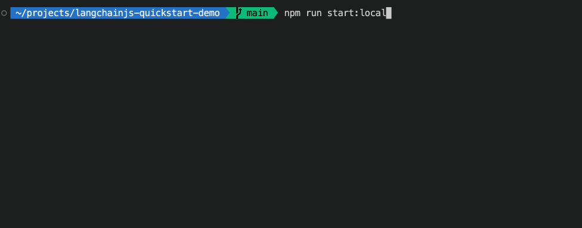

<!-- Learn samples onboarding: https://review.learn.microsoft.com/en-us/help/contribute/samples/process/onboarding?branch=main -->

This sample explores the development journey of building a generative AI application using LangChain.js and Azure, from idea to production. This demo uses a RAG-based approach for a Q&A system based on YouTube video transcripts.



## Overview

This application allows to ask text-based questions about a YouTube video, and uses the transcript of the video to generate responses.

The code comes in two versions:
- [local prototype](src/local.js): uses FAISS and Ollama with LLaMa3 model for completion and all-minilm-l6-v2 for embeddings
- [Azure cloud version](src/azure.js): uses Azure AI Search and GPT-4 Turbo model for completion and text-embedding-3-large for embeddings

Either version can be run as an API using the [Azure Functions](https://azure.microsoft.com/services/functions) runtime.

> [!NOTE]
> This sample uses the new HTTP streaming support in Azure Functions that's currently in preview. You can find more information about this feature in the [blog post announcement](https://techcommunity.microsoft.com/t5/apps-on-azure-blog/azure-functions-support-for-http-streams-in-node-js-is-now-in/ba-p/4066575).

<div align="center">
  
</div>

This application is made from multiple components:

- A serverless API built with [Azure Functions](https://learn.microsoft.com/azure/azure-functions/functions-overview?pivots=programming-language-javascript) and using [LangChain.js](https://js.langchain.com/). We use LangChain.js to retrieve the video transcript from YouTube, ingest it and generate responses to the user chat queries. The code is located in the `src/functions` folder.

- A database to store the text extracted from the documents and the vectors generated by LangChain.js, using [Azure AI Search](https://learn.microsoft.com/azure/search/).

## Prerequisites

- [Node.js LTS](https://nodejs.org/download/)
- [Ollama](https://ollama.com/download)
- [Git](https://git-scm.com/downloads)
- Azure account. If you're new to Azure, [get an Azure account for free](https://azure.microsoft.com/free) to get free Azure credits to get started. If you're a student, you can also get free credits with [Azure for Students](https://aka.ms/azureforstudents).
- Azure subscription with access enabled for the Azure OpenAI service. You can request access with [this form](https://aka.ms/oaiapply).

## Setup the sample

After you complete the installation of the required tools, the next step is to clone this repository on your machine:

1. [**Fork**](https://github.com/Azure-Samples/langchainjs-quickstart-demo/fork) the project to create your own copy of this repository.
2. On your forked repository, select the **Code** button, then the **Local** tab, and copy the URL of your forked repository.
    <div align="center">
      
    </div>
3. Open a terminal and run this command to clone the repo: `git clone <your-repo-url>`
4. Switch to the project directory: `cd langchainjs-quickstart-demo`
5. Run the following commands:
    ```bash
    npm install
    ollama pull llama3
    ollama pull all-minilm:l6-v2
    ```

    This will install the required dependencies and download the models needed for the demo.

## Run the prototype locally

This demo comes in three versions: a local prototype, an Azure cloud version, and an API version using Azure Functions. First, we'll run the local prototype.

In the terminal, run the following command:

```bash
npm run start:local
```

You should see the various steps of the process in the terminal, with at the end the response generated by the model.

## Run the Azure version

To run the Azure version, you need to have an Azure account and a subscription enabled for Azure OpenAI usage. If you don't have an Azure account, you can create a [free account](https://azure.microsoft.com/free/) to get started.

For Azure OpenAI, you can [request access with this form](https://aka.ms/oaiapply).

### Create the Azure resources

First you need to create an Azure OpenAI instance. You can deploy a version on Azure Portal following [this guide](https://learn.microsoft.com/azure/ai-services/openai/how-to/create-resource?pivots=web-portal).

In Azure AI Studio, you'll need to deploy these two models:
- `text-embedding-3-large` with a deployment name of `text-embedding-3-large`
- `gpt-4` version `0125-preview` (aka GPT-4 Turbo) with a deployment name of `gpt4-turbo`

> [!IMPORTANT]
> GPT-4 Turbo is currently in preview and may not be available in all regions, see [this table](https://learn.microsoft.com/azure/ai-services/openai/concepts/models#gpt-4-and-gpt-4-turbo-preview-models) for region availability.

You'll also need to have an Azure AI Search instance running. You can deploy a free version on Azure Portal without any cost, following [this guide](https://learn.microsoft.com/azure/search/search-create-service-portal).

#### Set up the environment

You need to create a `.env` file with the following content:

```bash
AZURE_AISEARCH_ENDPOINT=https://<your-service-name>.search.windows.net
AZURE_AISEARCH_KEY=<your-aisearch-key>
AZURE_OPENAI_API_KEY=<your-openai-key>
AZURE_OPENAI_API_ENDPOINT=<your-openai-endpoint>
AZURE_OPENAI_API_DEPLOYMENT_NAME="gpt4-turbo"
AZURE_OPENAI_API_EMBEDDINGS_DEPLOYMENT_NAME="text-embedding-3-large"
```

Once your environment is set up, you can run the Azure version with the following command:

```bash
npm run start:azure
```

## Run the API version

Run the following command in a terminal to start the API:

```bash
npm start
```

Once the server is running, you can test the API in another terminal:

```bash
curl http://localhost:7071/api/ask --json '{ "question": "Will GPT-4 Turbo be available on Azure?" }'
```

By default, the API runs the local version. To run the Azure version, you need to set the `USE_AZURE` environment variable to `true`:

```bash
USE_AZURE=true npm start
```

> [!TIP]
> The API respond as a stream of text. You can use the `curl` command with the `-N` option to disable buffering and see the response in real-time.

## Key concepts

The different versions of the application you ran shows the various steps of the development process, from a local prototype to a ready-to-deploy serverless API.

If you take a look at the different versions of the code, you'll see that the core logic remains the same and the code changes are minimal:

1. In the [local prototype](src/local.js), we set up the core of our application logic. We use various LangChain.js components to get the text transcript of the video, split it into smaller chunks, generate vectors for each chunk, and store the text and vectors in the database. We then use the vectors to generate responses to the user queries, use a retrieval chain.

2. In the [Azure version](src/azure.js), we changed only a few lines of code to swap the models and the database used. Instead of using FAISS and Ollama, we use Azure AI Search and Azure OpenAI to replace the local components. Before ingestion, we also added a check to see if the document is already in the database to avoid duplicates.

3. In the [API version](src/functions/ask.js), we use Azure Functions to deploy our application as a serverless API. We added the HTTP query handling and response streaming logic here. Again, we only changed a few lines in the [core logic code](src/functions/lib/azure.js) to wrap it into an [async generator function](https://developer.mozilla.org/docs/Web/JavaScript/Reference/Global_Objects/AsyncGenerator) to stream the response to the client.

## Next steps

If you want to learn more about the technologies used in this demo, check out the following resources:

- [LangChain.js documentation](https://js.langchain.com)
- [Generative AI For Beginners](https://github.com/microsoft/generative-ai-for-beginners)
- [Azure OpenAI Service](https://learn.microsoft.com/azure/ai-services/openai/overview)
- [Azure AI Search](https://learn.microsoft.com/azure/search/)

You can also find [more Azure AI samples here](https://github.com/Azure-Samples/azureai-samples).
